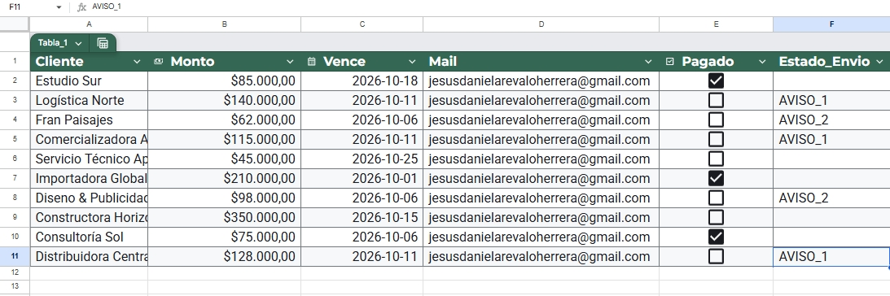

# 📊 Sistema de Gestión y Automatización de Cobros (Google Apps Script + Gmail)

Sistema automatizado desarrollado con Google Apps Script para optimizar la gestión de cuentas por cobrar, reducir la morosidad y eliminar la redacción manual de recordatorios de pago.

## 🚀 Problema de Negocio
El seguimiento manual de vencimientos de facturas consume tiempo operativo y genera demoras en el flujo de caja debido a descuidos en el envío oportuno de recordatorios a clientes.

## 🛠️ Solución Implementada
Un flujo automatizado en la nube que:
- Revisa diariamente el estado de pago de cada cliente en Google Sheets.
- Envía automáticamente correos dinámicos en HTML 5 días antes del vencimiento y el día del vencimiento.
- Evita correos duplicados mediante el registro automático de estados (`AVISO_1`, `AVISO_2`).
- Consolida y envía un informe diario al administrador con el resumen de notificaciones enviadas.

## 💻 Tecnologías Utilizadas
- **Google Apps Script** (JavaScript / Apps Script API)
- **Google Sheets API & Gmail API**
- **HTML & CSS Inline** (Plantilla de correo responsiva)

## 📸 Vista Previa

## ⚙️ Instalación y Configuración
1. Clona o copia los datos de `templates/plantilla_datos.csv` en una hoja de Google Sheets llamada `Cobros`.
2. Ve a `Extensiones > Apps Script` e inserta el código ubicado en `src/codigo.gs`.
3. Configura un activador (*Trigger*) por tiempo diario entre las 7:00 AM y 8:00 AM para la función `enviarAvisos`.
